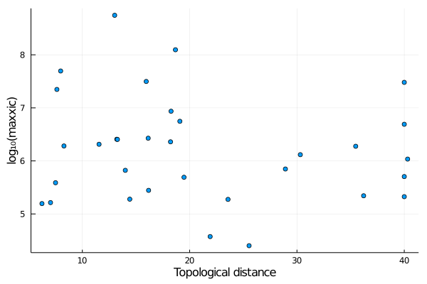
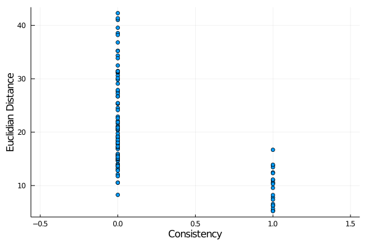

# XLStats

A package to analyze the correlations between structural distances and mass-spectrometry quantitative data of chemical-crosslinks obtained with SimXL. The structural properties are supposed to be computed from models (PDB files) using TopoLink.

## Installing

```julia
julia> ] add https://github.com/m3g/XLStats.jl
```

## Example

The example files are available at the `test/data` directory. 

### Reading the data

```julia
julia> using XLStats

julia> links = read_all(xml_file="./data/hitsDetail.xls",
                        topolink_log="./data/salbiii_topolink.log",
                        topolink_input="./data/topolink.inp",
                        xic_file_name="./data/salbiii_xic.dat",
                        domain=2:134)
 Reading all data files... 
 Reading XML file ... 
 Reading XIC data... 
 Vector of Links with: 102 links.
```

The data of the links now stored in the `links` vector can be accessed using the indexes of the vector. The vector is sorted by the residue numbers:

```julia
julia> links[1]
Link
  name: String "M1-K8"
  consistency: Bool false
  deuc: Float64 9.479
  dtop: Float64 19.066
  dmax: Float64 -1.0
  nspecies: Int64 3
  hasxic: Bool true
  scans: Array{XLStats.Scan}((18,))


```

And the links can also be retrieved by link name:

```julia
julia> links["M1-K8"]
Link
  name: String "M1-K8"
  consistency: Bool false
  deuc: Float64 9.479
  dtop: Float64 19.066
  dmax: Float64 -1.0
  nspecies: Int64 3
  hasxic: Bool true
  scans: Array{XLStats.Scan}((18,))

```

The scan data then can be accessed for each of the scans of that link (`18` in the example above):

```julia
julia> links["M1-K8"].scans[5]
XLStats.Scan
  index: Int64 2056
  pep1: String ""
  pep2: String ""
  score1: Float64 2.794
  score2: Float64 1.71
  pos1: Int64 0
  pos2: Int64 0
  source_file: String ""
  mplush: Float64 2070.02048274822
  prec_charge: Int64 0
  matched_alpha: Int64 0
  matched_beta: Int64 0
  retention_time: Float64 0.0
  xic: Float64 1.1079529279e8

```

### Available parameters

The goal is to probe correlations between the spectral parameters and the topological (surface-accessible) distances obtained with TopoLink. The `Link` structure contains the following fields:

| field name    | Meaning                       | type of value     | Example                   |
|:-------------:|:-----------------------------:|:-----------------:|:-------------------------:|
| `name`        | Name of link                  | `String`          | `"K17-K6"`                |
| `consistency` | Consistency with the structure | `Bool`            | `false`                   |
| `deuc`        | Euclidean distance            | `Float64`         | `16.696`                  |
| `dtop`        | Topological distance           | `Float64`         | `18.218`                  |
| `dmax`        | Maximum linker length         | `Float64`         | `17.000`                  |
| `nspecies`    | Number of species of the XL   | `Int`             | `7`                       |
| `hasxic`      |  XIC data is available?       | `Bool`            | `false`                   |
| `scans`       | Scan data available           | `Vector{Scan}`    | See below                 |

The `scans` field contains the data available for every `scan` of that link. It is a vector of instances of the `Scan` type, which contains the following fields:

| field name    | Meaning                       | type of value     | Example                   |
|:-------------:|:-----------------------------:|:-----------------:|:-------------------------:|
| `index`       |  Index of this scan           | `Int`             | `12981`                   | 
| `pep1`        |  Peptide sequence             | `String`          | `"VFWGMTDIGVWNSSSVDKLA"`  |
| `pep2`        |  Peptide sequence             | `String`          | `"VKINAVDVFTLTPEGK"`      |
| `score1`      |  Primary score                | `Float64`         | `5.955`                   |
| `score2`      |  Secondary score              | `Float64`         | `3.931`                   |
| `pos1`        |  Position 1                   | `Int`             | `13`                      |
| `pos2`        |  Position 1                   | `Int`             | `2`                       |
| `source_file` |  Source file name of scan     | `String`          | `"20151223_sample1.raw"`  |
| `mplush`      |  Some of precursor and H masses | `Float64`       | `4599.3431`               | 
| `prec_charge` |  Precursor charge             | `Int`             | `5`                       |
| `matched_alpha` | Peaks matching alpha         | `Int`             | `31`                     |
| `matched_beta` | Peaks matching beta           | `Int`             | `10`                     |
| `retention_time` | Retention time              | `Float64`       | 49.716795                  |
| `xic`         | XIC value                    | `Float64`          |  `157034.76`              |


### Ploting correlations

For example, lets plot the correlation between the topological distance of each link and the maximum `score1`. There are helper functions (see below) for each of these scores:

```julia
julia> using Plots

julia> x = deuc(links);

julia> y = maxscore1(links);

julia> scatter(x,y,label="",xlabel="Euclidian distance",ylabel="Maximum score1")

```
produces:


Note that the functions `deuc` and `maxscore1`, in the example, return vectors of data extracted for every link in the `links` list. Similar functions exist for the other parameters, and are:

`name`, `resnames`, `indexes`, `indomain`,
`consistency`, `deuc`, `dtop`, `dmax`, `nscans`,
`maxscore1`, `avgscore1`, `maxscore2`, `avgscore2`, `hasxic`, `maxxic`, `avgxic`, `nspecies`, `count_nspecies`

*Note:* Not necessarily all that is availalble for every link. Some of these functions will return `missing` values, which are properly handled (not shown) by Plots. If the vectors of values without missing values are necessary, use, for example,
```julia
y = skipmissing(maxscore1(links))
```

*Note 2:* The `consistency` function is special. It returns `true` or `false` depending if the topological distance (`dtop`) of the XL is smaller than the maximum linker reach (`dmax`), up to a tolerance `tol`. By default `tol=0`, but the function accepts the tolerance as an argument. Thus, for example:  

```julia
julia> x = consistency(links);
```
will return `1` for all links for which `dtop < dmax`. But  
```julia
julia> x = consistency(links,tol=2.0)
```
will return `1` all links for which `dtop < dmax + 2.0`.

### Filter links

The functions above allow filtering the links by any criteria, using the standard `filter` function. For example,

```julia
julia> bad_links = filter( link -> consistency(link,tol=2.0) == false, links )
 Vector of Links with: 84 links.

julia> large_deuc = filter( link -> deuc(link) > 10, links )
 Vector of Links with: 99 links.
```

In the data provided, not all links have `score1` data. Thus, if one wants to filter the links by `score1` threshold, first the links with data have be filtered:

```
julia> links_with_score1 = filter( link -> !ismissing(maxscore1(link)), links )
 Vector of Links with: 88 links.
``` 
Note the `!` which negates the `ismissing` condition. This type of filter is important before any tentative to find correlations between two types of data. It only makes sense to correlate the values in the subsets of links which contain both type of data.

Then we can filter by maximum score:
```julia
julia>  large_score1 = filter( link -> maxscore1(link) > 5., links_with_score1)
 Vector of Links with: 7 links.
```

The `resnames` and `indexes` functions also allow filtering by residue types and indexes. 
Since the permutation between types are usually meaningless, the `ismatch` function is provided:

```julia
julia> resnames(links[2])
("ASP", "GLU")

julia> ismatch(resnames(links[2]),("ASP","GLU"))
true

julia> ismatch(resnames(links[2]),("GLU","ASP"))
true

julia> indexes(links[2])
(3, 111)

julia> ismatch(indexes(links[2]),(111,3))
true

julia> ismatch("D108-E143","E143-D108")
true
```
Thus this function can be used for proper filtering of links by type, for example:

```julia
julia> filter( link -> ismatch(resnames(link),("SER","LYS")), links )
 Vector of Links with: 21 links.
```

To filter the links by residue numbers, the `indomain` function is mostly useful:
```julia
julia> indexes(links[2])
(3, 111)

julia> indomain(links[2],1:131)
true

julia> indomain(links[2],1:100)
false

julia> mydomain = filter(link -> indomain(link,1:110), links)
 Vector of Links with: 61 links.
```

### Remarks on XIC data

XIC data might not be available for every XL, or every scan of every XL. Scans without XIC data will show `-1` at the XIC field. The links for which XIC data is available can be filtered with:

```julia
julia> links_with_xic = filter(link -> hasxic(link), links)
 Vector of Links with: 20 links.
```

and then it makes sense to use the `avgxic` and `maxxic` functions in this subset of data. Note that `avgxic` will compute the average value of XIC data disregarding any missing XIC, even if not every scan for the link has XIC data. 

XIC data also spans many orders of magnitude. Thus, converting it a `log10` scale is handy. This can be readily using the `.` (dot) syntax in Julia, for example:

```julia
julia> x = dtop(links_with_xic);

julia> y = log10.(maxxic(links_with_xic));

julia> scatter(x,y,label="",xlabel="Topological distance",ylabel="log₁₀(maxxic)")
```

(note the `.` after `log10`, which means that the function will be applied to every element of the array that follows). 
This produces:



### Point-biserial correlation

When studying the consistency of a continuous variable with a discrete variable, an interesting parameter to be computed is the Point-Biserial correlation. For example:
```julia
julia> y = deuc(links);

julia> x = consistency(links);

julia> scatter(x,y,label="",xlabel="Consistency",ylabel="Euclidian Distance",xlims=[-0.5,1.5])
```
produces

This shows a correlation between these two variables, but a standard Pearson correlation is not an adequate measure of that correlation. The `point_biserial` function computes one appropriate measure of this correlation:
```julia
julia> point_biserial(x,y)
-0.5950247343012209
```

### Exporting data 

To export data to be analyzed by other software use the `DelimitedFiles` package:

- Install with
```julia
julia> ] add DelimitedFiles
```

- For example, write a data file with
```julia
julia> using DelimitedFiles

julia> writedlm("mydata.txt",[x y])
```

where `x` and `y` could be obtained by the commands of the examples above.


