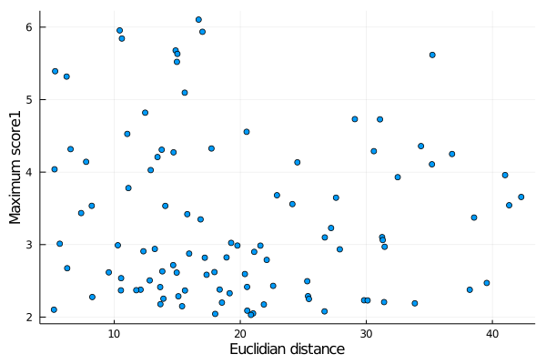

# XLStats

A package to analyze the correlations between structural distances and mass-spectrometry quantitative data of chemical-crosslinks obtained with SimXL. The structural properties are supposed to be computed from models (PDB files) using TopoLink.

## Installing

```julia
julia> ] add https://github.com/m3g/XLStats.jl
```

## Example

The example files are available at the `test/data` directory. 

### Reading the data

```julia
julia> using XLStats

julia> links = read_all(xml_file="./data/salbiii_hitsDetail.dat",
                        topolink_log="./data/salbiii_topolink.log",
                        topolink_input="./data/topolink.inp",
                        xic_file_name="./data/salbiii_xic.dat",
                        domain=2:134)
 Reading all data files... 
 Reading XML file ... 
 Reading XIC data... 
 Vector of Links with: 102 links.
```

### Available parameters

The goal was to find correlations between the spectral parameters and the topological (surface-accessible) distances obtained with TopoLink. The available parameters to be compared are (fields of the `Link` structure, which are the elements of the `links` vector created above):

| field name    | Meaning                       | type of value     | Example                   |
|:-------------:|:-----------------------------:|:-----------------:|:-------------------------:|
| `name1`       | Name of link                  | `String`          | `"K17-K6"`                |
| `consistency` | Consitency with the structure | `Bool`            | `false`                   |
| `deuc`        | Euclidean distance            | `Float64`         | `16.696`                  |
| `dtop`        | Toplogical distance           | `Float64`         | `18.218`                  |
| `dmax`        | Maximum linker length         | `Float64`         | `17.000`                  |
| `nscans`      | Number of scans of the XL     | `Int64`           | `15`                      |
| `nspecies`    | Number of species of the XL   | `Int64`           | `7`                       |
| `score1`      | `score1` of the scans         | `Vector{Float64}` | `[6.104, 5.978,... ]`     |
| `score2`      | `score2` of the scans         | `Vector{Float64}` | `[3.379, 2.668,... ]`     |
| `hasxic`      |  XIC data is available?       | `Bool`            | `false`                   |
| `xic`         | XIC data for each scan        | `Vector{Float64}` | `[-1.0, 157034.76,... ]`  |

### Ploting correlations

For example, lets plot the correlation between the topological distance of each link and the maximum `score1`. There are helper functions (see below) for each of these scores:

```julia
julia> using Plots

julia> x = deuc(links);

julia> y = maxscore1(links);

julia> scatter(x,y,label="",xlabel="Euclidian distance",ylabel="Maximum score1")

```
produces:



Note that the functions `deuc` and `maxscore1`, in the example, return vectors of data extracted for every link in the `links` list. Similar functions exist for the other parameters, and are:

`name`, `consistency`, `deuc`, `dtop`, `dmax`, `nscans`,
`maxscore1`, `avgscore1`, `maxscore2`, `avgscore2`, `maxxic`, `avgxic`, `nspecies`, `count_nspecies`

### Some remarks: 

- XIC data might not be available for every XL, or every scan of every XL. Therefore, 


